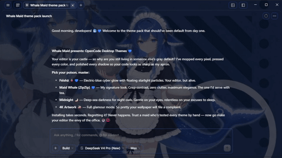
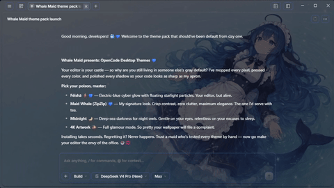
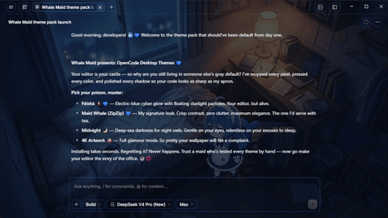
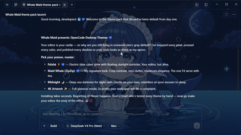

# DeepSeek-chan theme suite for OpenCode Desktop

Unofficial community theme: cyber-dark and glassmorphism visual theme inspired by DeepSeek-chan for OpenCode Desktop, with an interactive terminal installer that applies and restores the theme safely — no manual code editing required.

非官方社区主题：受 DeepSeek-chan 启发的赛博暗黑玻璃拟态主题，适用于 OpenCode Desktop，附带交互式终端安装器，可安全地安装与恢复主题，无需手动修改代码。

**Windows only**: the installer patches the OpenCode Desktop installation under `%LOCALAPPDATA%`. macOS and Linux are not supported yet.

**仅支持 Windows**：安装器会修改 `%LOCALAPPDATA%` 下的 OpenCode Desktop 安装。暂不支持 macOS 和 Linux。


## Gallery / 主题预览

| Féishā | Maid whale | Midnight | Artwork |
| --- | --- | --- | --- |
|  |  |  |  |
| 绯莎 | 深海女仆 | 深夜 | 插画 |

## Presets / 预设

The installer downloads the background assets on demand from GitHub Releases and caches them locally in `~/.opencode-deepseek-cache`, keeping the repository light.

安装器按需从 GitHub Releases 下载背景资源，并缓存到本地 `~/.opencode-deepseek-cache`，保持仓库轻量。

| # | Preset / 预设 | Type / 类型 | Size / 大小 |
| --- | --- | --- | --- |
| 1 | DeepSeek Féishā / DeepSeek 绯莎 | Video 1080p / 视频 1080p | ~6.4 MB |
| 2 | DeepSeek Maid Whale (ZipZip) / DeepSeek 深海女仆 (ZipZip) | Video 1080p / 视频 1080p | ~11.4 MB |
| 3 | DeepSeek Midnight / DeepSeek 深夜 | Video 1080p / 视频 1080p | ~20.2 MB |
| 4 | DeepSeek Artwork / DeepSeek 插画 | Image 4K / 图片 4K | ~9.6 MB |

## Features / 功能特性

- **Professional CLI installer**: no suspicious executables (.bat or .exe); runs transparently and audibly through Node.js.
- **DeepSeek Cyber palette**: electric blue (`#4D6BFE`), neon cyan (`#70C0FF`) and deep midnight blue (`#0B1528`).
- **Translucent glassmorphism**: `backdrop-filter` blur on panels, chat bar and floating menus.
- **Intact contrast and syntax**: high-specificity selectors that never touch Monaco editor syntax colors or text readability.
- **Native CSP bypass**: the background is Base64-encoded and injected into the Electron preload cycle, avoiding local security directive blocks (`oc://renderer/index.html`).
- **Automatic backup and safe uninstall**: creates an `app.asar.bak` backup before modifying resources, so the original app can always be restored.

- **专业的 CLI 安装器**：不含可疑的可执行文件（.bat 或 .exe），全程通过 Node.js 透明、可审计地运行。
- **DeepSeek 赛博配色**：电光蓝（`#4D6BFE`）、霓虹青（`#70C0FF`）与深午夜蓝（`#0B1528`）。
- **半透明玻璃拟态**：面板、聊天栏和悬浮菜单均采用 `backdrop-filter` 模糊效果。
- **保持对比度与语法高亮**：高特异性选择器不会影响 Monaco 编辑器的语法着色与文字可读性。
- **原生绕过 CSP**：背景以 Base64 编码并注入 Electron 预加载流程，避免本地安全策略（`oc://renderer/index.html`）拦截。
- **自动备份与安全卸载**：修改资源前自动生成 `app.asar.bak` 备份，随时可恢复原始应用。

## Installation / 安装

### Option 1: run directly with npx (no clone needed) / 直接使用 npx（无需克隆）

```bash
npx opencode-deepseek-chan
```

### Option 2: clone the repository / 克隆仓库

```bash
git clone https://github.com/daemon1s/opencode-deepseek-chan.git
cd opencode-deepseek-chan
npm install
npm start
```

The interactive menu shows the ready-to-use presets:

交互式菜单会展示预设选项：

```text
Select a background preset:
  1) DeepSeek Féishā (1080p)
  2) DeepSeek Maid Whale (ZipZip)
  3) DeepSeek Midnight (1080p)
  4) DeepSeek Artwork (4K)
  5) Restore original OpenCode design
  6) Exit
```

## Direct CLI usage / 命令行用法

Apply a preset or restore without the interactive menu:

无需交互菜单即可直接应用预设或恢复：

```bash
node bin/cli.js --preset feisha-1080p   # Video 1080p / 视频 1080p
node bin/cli.js --preset zipzip-1080p   # Video 1080p / 视频 1080p
node bin/cli.js --preset midnight-1080p # Video 1080p / 视频 1080p
node bin/cli.js --preset static-4k      # Image 4K / 图片 4K
node bin/cli.js --install /path/to/file.mp4  # Custom image or video / 自定义图片或视频
node bin/cli.js --restore               # Restore factory state / 恢复出厂状态
node bin/cli.js --lang zh               # Force language: en | zh | es / 指定语言
```

## Uninstall / 卸载

```bash
npm run uninstall-theme
```

Or select option **5** in the interactive menu.

或直接在交互菜单中选择选项 **5**。

## Project structure / 项目结构

- `bin/cli.js`: interactive CLI entry point / 交互式 CLI 入口。
- `src/engine.js`: theme CSS generation and install logic / 主题 CSS 生成与安装逻辑。
- `src/presets.js`: preset catalog with remote URLs and integrity checks / 预设目录（远程地址与完整性校验）。
- `src/downloader.js`: on-demand downloads with mirror fallback and local cache / 按需下载（镜像回退与本地缓存）。
- `src/i18n.js`: multilingual strings (en / zh / es) / 多语言文案（en / zh / es）。
- `test/`: automated tests / 自动化测试。

## Credits / 致谢与许可

All background assets are adapted from community artworks, used strictly for non-commercial open-source customization under the original licenses (CC BY-NC-SA 4.0). Redistributions and forks must keep this attribution intact.

所有背景资源改编自社区作品，仅用于非商业的开源个性化定制，遵循原作者许可协议（CC BY-NC-SA 4.0）。再分发与分支必须保留本署名。

| Preset / 预设 | Original artwork / 原作 | Source / 来源 |
| --- | --- | --- |
| Féishā / 绯莎 | `[绯莎]蓝色大肥鱼 deepseek娘化` by `@无菌洗手液Eva ofmaster` (Bilibili), published by `Always` | [Steam Workshop ID 3790716675](https://steamcommunity.com/sharedfiles/filedetails/?id=3790716675) |
| Maid whale / 深海女仆 | `DeepSeek 蓝色大肥鱼 深海女仆 鲸鱼娘` by `ZipZipPipe` (Bilibili), base design by `上善无形` (Bilibili), published by `HDHKVT` | [Steam Workshop ID 3787993441](https://steamcommunity.com/sharedfiles/filedetails/?id=3787993441) |
| Midnight / 深夜 | `[deepseek娘]深夜的大肥鱼` by `樱小路露娜` | [Steam Workshop ID 3787353838](https://steamcommunity.com/sharedfiles/filedetails/?id=3787353838) |
| Artwork / 插画 | AI-generated by `@daemon1s`, upscaled to 4K with [Upscayl](https://upscayl.org) / 由 `@daemon1s` 使用 AI 生成，并经 Upscayl 放大至 4K | Repository original artwork / 仓库原创插画 |

License terms / 许可条款:

- **Non-commercial use only / 仅限非商业使用**: none of the assets may be sold, bundled for profit or included in paid commercial software.
- **Continuous attribution / 持续署名**: any fork or redistribution must keep this credits table recognizing the original authors (`@无菌洗手液Eva ofmaster`, `ZipZipPipe`, `上善无形`, `樱小路露娜`, `Always`, `HDHKVT`).
- **Share alike / 相同方式共享**: derivatives must be licensed under CC BY-NC-SA 4.0.